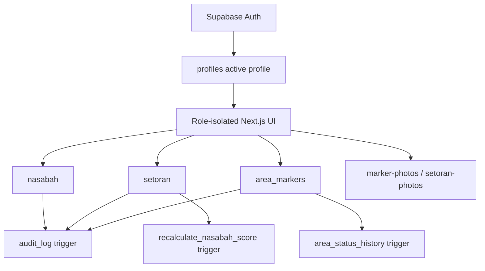

# System Architecture — LendMap PWA
**Version:** 1.0.0
**Status:** Planning Baseline + 2026-06-14 Implementation Addendum

---

## 1. Architecture Overview

```
┌─────────────────────────────────────────────────────────┐
│                    CLIENT (Browser/PWA)                  │
│                                                         │
│  ┌──────────────┐  ┌──────────────┐  ┌──────────────┐  │
│  │  React SPA   │  │  Leaflet.js  │  │  IndexedDB   │  │
│  │  (Next.js)   │  │  (Map Layer) │  │ (Offline Q)  │  │
│  └──────┬───────┘  └──────┬───────┘  └──────┬───────┘  │
│         └─────────────────┴──────────────────┘          │
│                    Service Worker                        │
│              (Cache + Offline Sync Queue)                │
└────────────────────────┬────────────────────────────────┘
                         │ HTTPS / WSS
┌────────────────────────▼────────────────────────────────┐
│                    SUPABASE (BaaS)                       │
│                                                         │
│  ┌──────────────┐  ┌──────────────┐  ┌──────────────┐  │
│  │  Auth (JWT)  │  │  PostgREST   │  │  Realtime    │  │
│  │  + RLS       │  │  (REST API)  │  │  (WebSocket) │  │
│  └──────────────┘  └──────────────┘  └──────────────┘  │
│  ┌──────────────┐  ┌──────────────┐  ┌──────────────┐  │
│  │  PostgreSQL  │  │  Storage     │  │  Edge Fn     │  │
│  │  (+ pgcrypto)│  │  (Photos)    │  │  (Push/CRON) │  │
│  └──────────────┘  └──────────────┘  └──────────────┘  │
└─────────────────────────────────────────────────────────┘
                         │
┌────────────────────────▼────────────────────────────────┐
│                    VERCEL (Hosting)                      │
│            Next.js App + Static Assets + CDN             │
└─────────────────────────────────────────────────────────┘
```

### 1.1 Current Source-of-Truth Addendum

Per 2026-06-14, core operational data is no longer treated as seed/local state:

- Auth session and active profile come from Supabase Auth + `profiles`.
- Nasabah list comes from Supabase `nasabah`.
- Setoran list and submit flow use Supabase `setoran`.
- Marker list and submit flow use Supabase `area_markers`.
- Marker photos use Storage bucket `marker-photos`.
- Setoran proof photos use Storage bucket `setoran-photos`.
- Local state remains for forms, loading/error state, optimistic display, and offline queue preview.



---

## 2. Technology Decisions

### 2.1 Frontend

| Technology | Version | Rationale |
|------------|---------|-----------|
| Next.js | 16 (App Router) | File-based routing, RSC for owner dashboard, patched line used by MVP scaffold |
| React | 19 | Current React line used by Next.js 16 |
| TypeScript | 5.x | Type safety wajib — agent coding perlu kontrak yang eksplisit |
| Tailwind CSS | 3.x | Utility-first, no runtime overhead, consistent dengan stack existing |
| Zustand | 4.x | Lightweight global state (auth state, offline queue, sync status) |
| React Query (TanStack) | 5.x | Server state management, caching, background refetch |
| Leaflet.js | 1.9.x | Open source map, no API key, tile dari OpenStreetMap |
| Workbox | 7.x | Service Worker management for production offline caching |

### 2.2 Backend (Supabase)

| Service | Usage |
|---------|-------|
| Supabase Auth | JWT-based auth, email+password, session management |
| PostgreSQL | Primary database dengan Row Level Security |
| Supabase Storage | Foto marker dan foto bukti setoran (bucket terpisah) |
| Supabase Realtime | Live update peta saat marker baru ditambah surveyor lain |
| Edge Functions (Deno) | Web Push VAPID sender, CRON scoring recalculation, laporan PDF generation |

### 2.3 Map Stack

```
Leaflet.js + OpenStreetMap tiles (gratis, no API key)
└── react-leaflet (React binding)
└── Leaflet.markercluster (clustering saat ratusan marker)
└── Tile caching via Workbox (offline map)
```

> **Catatan migrasi:** Jika di masa depan butuh custom styling atau satellite view, Mapbox GL JS dapat di-swap masuk tanpa mengubah data layer karena koordinat disimpan sebagai `latitude/longitude` biasa.

### 2.4 Offline Architecture

```
User Action (offline)
       │
       ▼
Zustand offlineQueue (in-memory)
       │
       ▼
IndexedDB (persisted, survives refresh)
       │
       ▼ (koneksi pulih)
Service Worker sync event
       │
       ▼
Supabase REST API (batch upsert)
       │
       ▼
Zustand state update + UI refresh
```

**Conflict Resolution Policy:**
- Setoran baru: `local wins` — tidak ada konflik karena ID generated di client (UUID v4)
- Status area update: `server wins` — jika ada dua surveyor update area sama, versi server yang dipakai + user diberi tahu
- Foto: upload setelah koneksi pulih, jika gagal masuk retry queue

---

## 3. Database Design

### 3.1 Schema

```sql
-- USERS (managed by Supabase Auth, extended via profiles)
CREATE TABLE profiles (
  id            UUID PRIMARY KEY REFERENCES auth.users(id) ON DELETE CASCADE,
  full_name     TEXT NOT NULL,
  role          TEXT NOT NULL CHECK (role IN ('surveyor', 'owner')),
  is_active     BOOLEAN NOT NULL DEFAULT true,
  max_nasabah   INT,                    -- NULL = unlimited, set by owner
  created_at    TIMESTAMPTZ NOT NULL DEFAULT NOW(),
  updated_at    TIMESTAMPTZ NOT NULL DEFAULT NOW()
);

-- AREA MARKERS
CREATE TABLE area_markers (
  id            UUID PRIMARY KEY DEFAULT gen_random_uuid(),
  surveyor_id   UUID NOT NULL REFERENCES profiles(id),
  latitude      DOUBLE PRECISION NOT NULL,
  longitude     DOUBLE PRECISION NOT NULL,
  status        TEXT NOT NULL CHECK (status IN ('potensial', 'bagus', 'kurang_prospektif')),
  notes         TEXT,
  photo_url     TEXT,                   -- Supabase Storage URL
  created_at    TIMESTAMPTZ NOT NULL DEFAULT NOW(),
  updated_at    TIMESTAMPTZ NOT NULL DEFAULT NOW()
);

-- AREA STATUS HISTORY (untuk audit trail perubahan status area)
CREATE TABLE area_status_history (
  id            UUID PRIMARY KEY DEFAULT gen_random_uuid(),
  marker_id     UUID NOT NULL REFERENCES area_markers(id),
  changed_by    UUID NOT NULL REFERENCES profiles(id),
  old_status    TEXT,
  new_status    TEXT NOT NULL,
  reason        TEXT,                   -- wajib untuk downgrade ke kurang_prospektif
  created_at    TIMESTAMPTZ NOT NULL DEFAULT NOW()
);

-- NASABAH
CREATE TABLE nasabah (
  id              UUID PRIMARY KEY DEFAULT gen_random_uuid(),
  surveyor_id     UUID NOT NULL REFERENCES profiles(id),
  nama            TEXT NOT NULL,
  alamat          TEXT NOT NULL,
  jumlah_pinjaman BIGINT NOT NULL,      -- dalam rupiah
  tanggal_mulai   DATE NOT NULL,
  tenor_bulan     INT NOT NULL,
  angsuran        BIGINT NOT NULL,
  tgl_jatuh_tempo INT NOT NULL CHECK (tgl_jatuh_tempo BETWEEN 1 AND 28),
  payment_frequency TEXT NOT NULL DEFAULT 'weekly',
  installment_count INT NOT NULL DEFAULT 6,
  installment_amount BIGINT NOT NULL DEFAULT 0,
  interest_amount BIGINT NOT NULL DEFAULT 0,
  principal_amount BIGINT NOT NULL DEFAULT 0,
  monthly_due_day INT,
  weekly_due_day INT,
  status          TEXT NOT NULL DEFAULT 'aktif' CHECK (status IN ('aktif', 'lunas', 'macet', 'hiatus')),
  review_status   TEXT NOT NULL DEFAULT 'approved' CHECK (review_status IN ('draft', 'approved', 'rejected')),
  submitted_by    UUID REFERENCES profiles(id),
  reviewed_by     UUID REFERENCES profiles(id),
  reviewed_at     TIMESTAMPTZ,
  review_notes    TEXT,
  score           NUMERIC(5,2) DEFAULT 0,
  score_label     TEXT DEFAULT 'At Risk',
  created_at      TIMESTAMPTZ NOT NULL DEFAULT NOW(),
  updated_at      TIMESTAMPTZ NOT NULL DEFAULT NOW()
);

-- NASABAH PAYMENT SCHEDULES
CREATE TABLE nasabah_payment_schedules (
  id                 UUID PRIMARY KEY DEFAULT gen_random_uuid(),
  nasabah_id         UUID NOT NULL REFERENCES nasabah(id) ON DELETE CASCADE,
  installment_number INT NOT NULL,
  original_due_date  DATE NOT NULL,
  due_date           DATE NOT NULL,
  amount_due         BIGINT NOT NULL,
  status             TEXT NOT NULL DEFAULT 'scheduled',
  is_holiday         BOOLEAN NOT NULL DEFAULT FALSE,
  holiday_label      TEXT,
  paid_at            TIMESTAMPTZ,
  setoran_id         UUID REFERENCES setoran(id) ON DELETE SET NULL
);

-- SETORAN
CREATE TABLE setoran (
  id              UUID PRIMARY KEY DEFAULT gen_random_uuid(),
  nasabah_id      UUID NOT NULL REFERENCES nasabah(id),
  surveyor_id     UUID NOT NULL REFERENCES profiles(id),
  tanggal         DATE NOT NULL,
  jumlah_dibayar  BIGINT NOT NULL,
  jatuh_tempo     DATE NOT NULL,
  status_bayar    TEXT NOT NULL CHECK (status_bayar IN ('tepat_waktu', 'terlambat', 'kurang')),
  foto_bukti_url  TEXT,                 -- optional, Supabase Storage URL
  notes           TEXT,
  schedule_id     UUID REFERENCES nasabah_payment_schedules(id),
  payment_type    TEXT NOT NULL DEFAULT 'installment',
  installment_number INT,
  interest_paid   BIGINT NOT NULL DEFAULT 0,
  principal_paid  BIGINT NOT NULL DEFAULT 0,
  idempotency_key TEXT,
  sync_status     TEXT NOT NULL DEFAULT 'synced',
  source_device   TEXT,
  created_at      TIMESTAMPTZ NOT NULL DEFAULT NOW()
);

-- AUDIT LOG
CREATE TABLE audit_log (
  id          UUID PRIMARY KEY DEFAULT gen_random_uuid(),
  actor_id    UUID REFERENCES profiles(id),
  action      TEXT NOT NULL,            -- 'INSERT', 'UPDATE', 'DELETE'
  table_name  TEXT NOT NULL,
  record_id   UUID,
  old_data    JSONB,
  new_data    JSONB,
  ip_address  INET,
  created_at  TIMESTAMPTZ NOT NULL DEFAULT NOW()
);

-- PUSH SUBSCRIPTIONS
CREATE TABLE push_subscriptions (
  id          UUID PRIMARY KEY DEFAULT gen_random_uuid(),
  user_id     UUID NOT NULL REFERENCES profiles(id),
  endpoint    TEXT NOT NULL UNIQUE,
  p256dh      TEXT NOT NULL,
  auth        TEXT NOT NULL,
  created_at  TIMESTAMPTZ NOT NULL DEFAULT NOW()
);

-- SURVEYOR LOCATIONS
CREATE TABLE surveyor_locations (
  surveyor_id      UUID PRIMARY KEY REFERENCES profiles(id) ON DELETE CASCADE,
  latitude         DOUBLE PRECISION NOT NULL,
  longitude        DOUBLE PRECISION NOT NULL,
  accuracy_meters  DOUBLE PRECISION,
  heading          DOUBLE PRECISION,
  speed_mps        DOUBLE PRECISION,
  captured_at      TIMESTAMPTZ NOT NULL,
  updated_at       TIMESTAMPTZ NOT NULL DEFAULT NOW()
);
```

### 3.2 Indexes

```sql
CREATE INDEX idx_area_markers_surveyor ON area_markers(surveyor_id);
CREATE INDEX idx_area_markers_status ON area_markers(status);
CREATE INDEX idx_nasabah_surveyor ON nasabah(surveyor_id);
CREATE INDEX idx_nasabah_status ON nasabah(status);
CREATE INDEX idx_setoran_nasabah ON setoran(nasabah_id);
CREATE INDEX idx_setoran_surveyor ON setoran(surveyor_id);
CREATE INDEX idx_setoran_tanggal ON setoran(tanggal);
CREATE UNIQUE INDEX idx_setoran_surveyor_idempotency
  ON setoran(surveyor_id, idempotency_key)
  WHERE idempotency_key IS NOT NULL;
CREATE INDEX idx_setoran_nasabah_tanggal ON setoran(nasabah_id, tanggal DESC);
CREATE INDEX idx_nasabah_review_status ON nasabah(review_status);
CREATE INDEX idx_nasabah_submitted_by ON nasabah(submitted_by);
CREATE INDEX idx_audit_log_actor ON audit_log(actor_id);
CREATE INDEX idx_audit_log_table ON audit_log(table_name, created_at);
```

### 3.3 Row Level Security (RLS)

```sql
-- profiles: setiap user hanya bisa lihat/edit profile sendiri. Owner bisa lihat semua
ALTER TABLE profiles ENABLE ROW LEVEL SECURITY;
CREATE POLICY "surveyor_own_profile" ON profiles
  FOR SELECT USING (auth.uid() = id OR EXISTS (
    SELECT 1 FROM profiles p WHERE p.id = auth.uid() AND p.role = 'owner'
  ));
CREATE POLICY "owner_manage_profiles" ON profiles
  FOR ALL USING (EXISTS (
    SELECT 1 FROM profiles p WHERE p.id = auth.uid() AND p.role = 'owner'
  ));

-- area_markers: surveyor hanya lihat milik sendiri, owner lihat semua
ALTER TABLE area_markers ENABLE ROW LEVEL SECURITY;
CREATE POLICY "surveyor_own_markers" ON area_markers
  FOR ALL USING (
    surveyor_id = auth.uid() OR EXISTS (
      SELECT 1 FROM profiles p WHERE p.id = auth.uid() AND p.role = 'owner'
    )
  );

-- nasabah: sama dengan markers
ALTER TABLE nasabah ENABLE ROW LEVEL SECURITY;
CREATE POLICY "surveyor_own_nasabah" ON nasabah
  FOR ALL USING (
    surveyor_id = auth.uid() OR EXISTS (
      SELECT 1 FROM profiles p WHERE p.id = auth.uid() AND p.role = 'owner'
    )
  );

-- setoran: surveyor hanya insert setoran untuk nasabah miliknya yang approved + aktif
ALTER TABLE setoran ENABLE ROW LEVEL SECURITY;
CREATE POLICY "surveyor_insert_own_setoran" ON setoran
  FOR INSERT WITH CHECK (
    surveyor_id = auth.uid()
    AND EXISTS (
      SELECT 1 FROM nasabah customer
      WHERE customer.id = nasabah_id
        AND customer.surveyor_id = auth.uid()
        AND customer.review_status = 'approved'
        AND customer.status = 'aktif'
    )
  );

-- audit_log: hanya owner yang bisa baca
ALTER TABLE audit_log ENABLE ROW LEVEL SECURITY;
CREATE POLICY "owner_read_audit" ON audit_log
  FOR SELECT USING (EXISTS (
    SELECT 1 FROM profiles p WHERE p.id = auth.uid() AND p.role = 'owner'
  ));
```

### 3.4 Table Access Matrix

| Resource | Owner | Surveyor | Notes |
| --- | --- | --- | --- |
| `profiles` | read/manage active users | read own profile | New users default to surveyor |
| `nasabah` | read all, create approved, review, hiatus/reactivate | create own draft, read own non-hiatus | Draft/rejected/hiatus cannot be used for setoran |
| `setoran` | read all, insert as owner | read/insert own approved-active customer setoran | `idempotency_key` reduces duplicate submit |
| `area_markers` | read/update all | read/update own markers | Insert creates status history trigger |
| `area_status_history` | read all | read own marker history | Trigger-owned, not client-written |
| `surveyor_locations` | read all | upsert own location | Realtime publication configured |
| `audit_log` | read | no access | DB trigger writes |
| `marker-photos` | read all allowed by policy | upload/read own path | `{userId}/{timestamp}-{slug}.{ext}` |
| `setoran-photos` | read all allowed by policy | upload/read own path | Optional proof upload |

---

## 4. Frontend Architecture

### 4.1 Directory Structure

```
src/
├── app/                          # Next.js App Router
│   ├── (auth)/
│   │   └── login/
│   ├── (surveyor)/
│   │   ├── map/                  # tracker map
│   │   ├── nasabah/              # daftar + input nasabah
│   │   └── setoran/              # input setoran
│   └── (owner)/
│       ├── dashboard/            # analytics overview
│       ├── map/                  # peta semua surveyor
│       ├── nasabah/              # semua nasabah
│       ├── karyawan/             # performa surveyor
│       └── laporan/              # export
├── components/
│   ├── ui/                       # atoms: Button, Input, Badge, Card
│   ├── map/                      # MapContainer, Marker, StatusBadge
│   ├── nasabah/                  # NasabahCard, NasabahForm, ScoreBadge
│   ├── setoran/                  # SetoranForm, SetoranHistory
│   └── dashboard/                # StatCard, TrendChart, AreaPieChart
├── hooks/
│   ├── useAuth.ts
│   ├── useOfflineQueue.ts
│   ├── useNasabah.ts
│   ├── useSetoran.ts
│   └── useMarkers.ts
├── lib/
│   ├── supabase.ts               # client init
│   ├── scoring.ts                # pure function — scoring algorithm
│   ├── offline.ts                # IndexedDB helpers
│   └── push.ts                   # Web Push helpers
├── store/
│   └── appStore.ts               # Zustand: auth, offline queue, sync status
└── types/
    └── index.ts                  # semua TypeScript interfaces
```

### 4.2 State Management Philosophy

```
Server State   → TanStack Query  (nasabah, setoran, markers dari Supabase)
Global UI State → Zustand        (auth, offline queue, sync indicator)
Local Form State → React useState (form inputs sebelum submit)
```

**Aturan:** Tidak ada business logic di JSX. Semua kalkulasi dan transformasi data di `hooks/` atau `lib/`. Komponen hanya render.

---

## 5. PWA Configuration

```js
// next.config.js
const withPWA = require('next-pwa')({
  dest: 'public',
  register: true,
  skipWaiting: true,
  runtimeCaching: [
    {
      urlPattern: /^https:\/\/tile\.openstreetmap\.org\/.*/,
      handler: 'CacheFirst',
      options: { cacheName: 'map-tiles', expiration: { maxEntries: 1000, maxAgeSeconds: 7 * 24 * 60 * 60 } }
    },
    {
      urlPattern: /^https:\/\/.*\.supabase\.co\/storage\/.*/,
      handler: 'CacheFirst',
      options: { cacheName: 'photo-cache', expiration: { maxEntries: 500 } }
    }
  ]
})
```

**Web App Manifest:**
- `display: standalone`
- `start_url: /`
- Icons: 192×192, 512×512
- `background_color` dan `theme_color` sesuai brand

---

## 6. Security Architecture

Lihat dokumen terpisah: `03-SECURITY.md`

---

## 7. Edge Functions

| Function | Trigger | Purpose |
|----------|---------|---------|
| `send-push-notification` | DB webhook (setoran insert) | Kirim Web Push ke surveyor terkait |
| `daily-payment-reminder` | CRON 08:00 WIB | Cek nasabah jatuh tempo hari ini dan besok |
| `recalculate-scores` | DB webhook (setoran insert/update) | Update score dan label nasabah |
| `generate-pdf-report` | HTTP POST dari owner dashboard | Generate PDF laporan menggunakan jsPDF + autotable |

---

## 8. Deployment

```
Branch: main → Vercel Production (auto-deploy)
Branch: develop → Vercel Preview (auto-deploy)

Environment Variables (Vercel + Supabase):
  NEXT_PUBLIC_SUPABASE_URL
  NEXT_PUBLIC_SUPABASE_ANON_KEY
  SUPABASE_SERVICE_ROLE_KEY      (Edge Functions only)
  VAPID_PUBLIC_KEY
  VAPID_PRIVATE_KEY
```

---

## 9. Scalability Notes

- Supabase free tier: 500MB DB, 1GB storage, 50k MAU — cukup untuk fase awal
- Ketika scale ke ratusan surveyor: upgrade ke Supabase Pro ($25/mo), aktifkan connection pooling (pgBouncer)
- Map tiles: OpenStreetMap fair use policy berlaku. Jika terlalu banyak request, self-host tile server via `tileserver-gl`
- IndexedDB offline queue: batasi 500 pending items per device, lebih dari itu tampilkan warning
