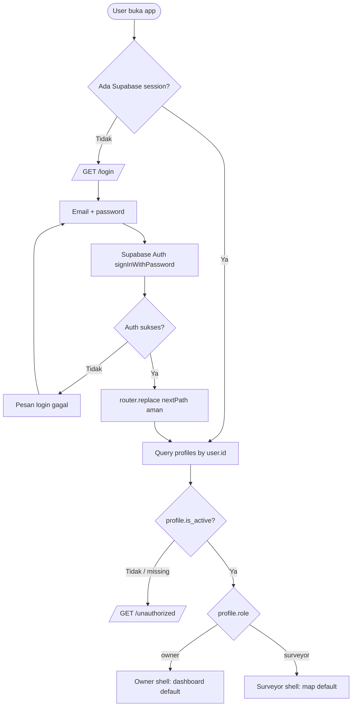
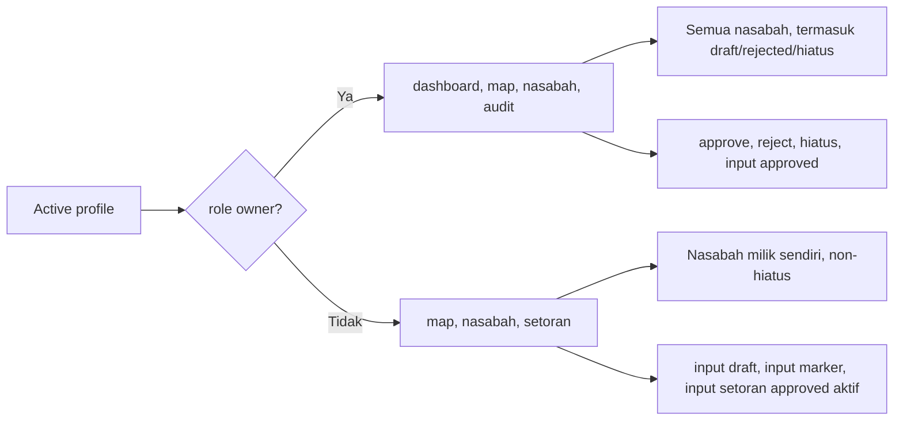
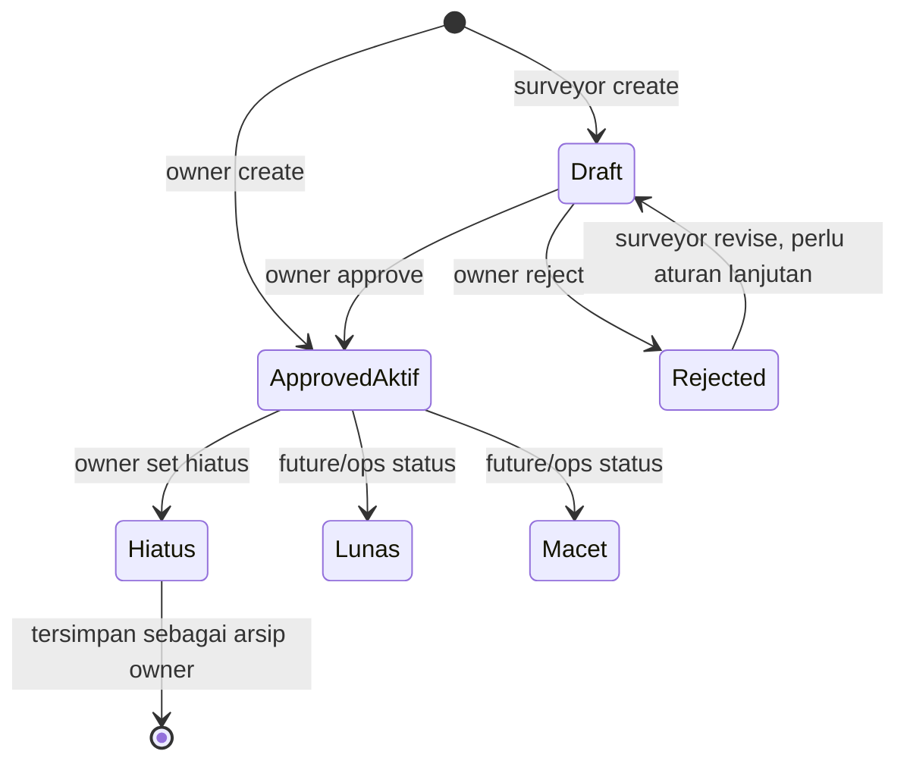
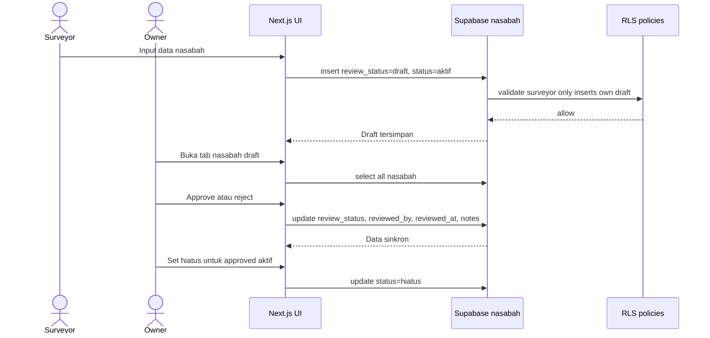
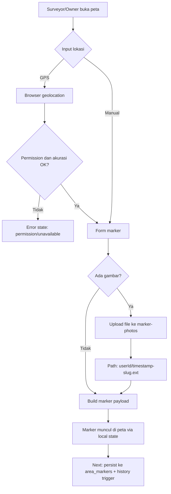
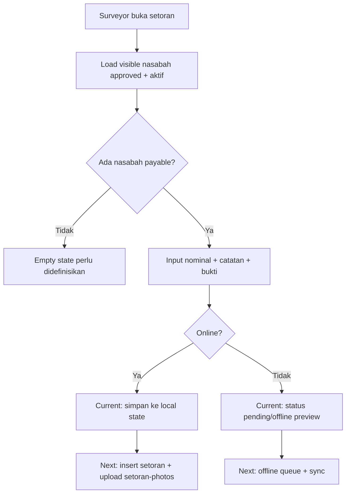
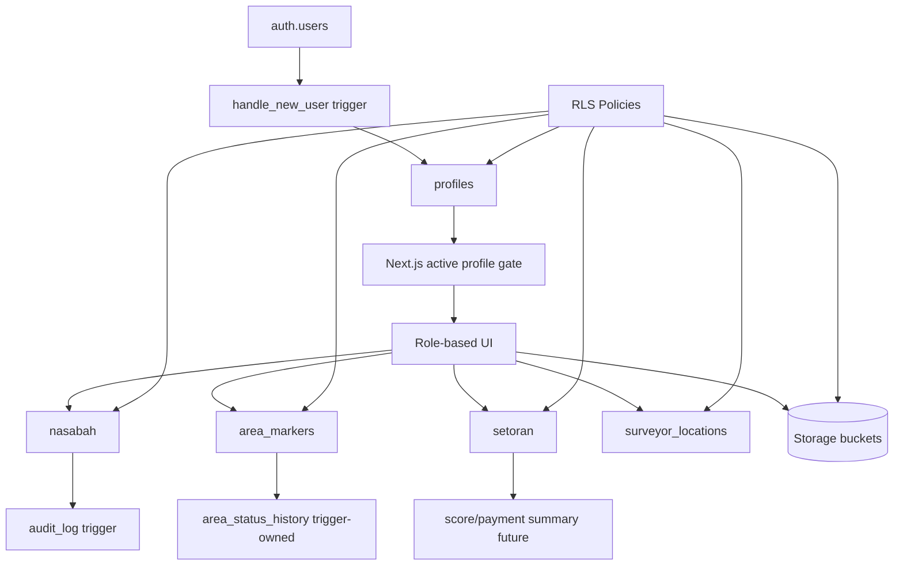
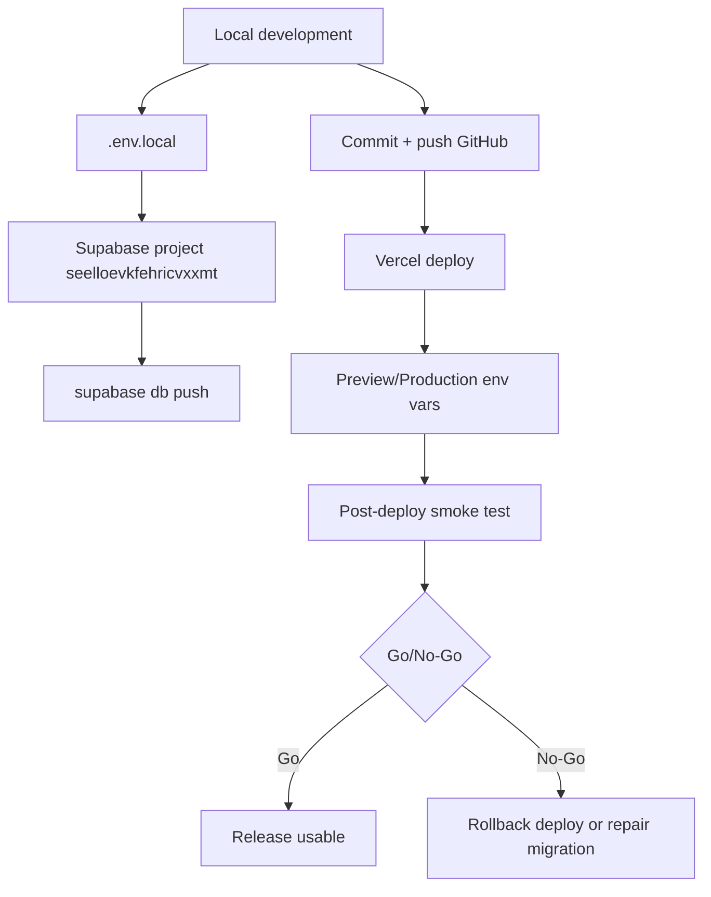
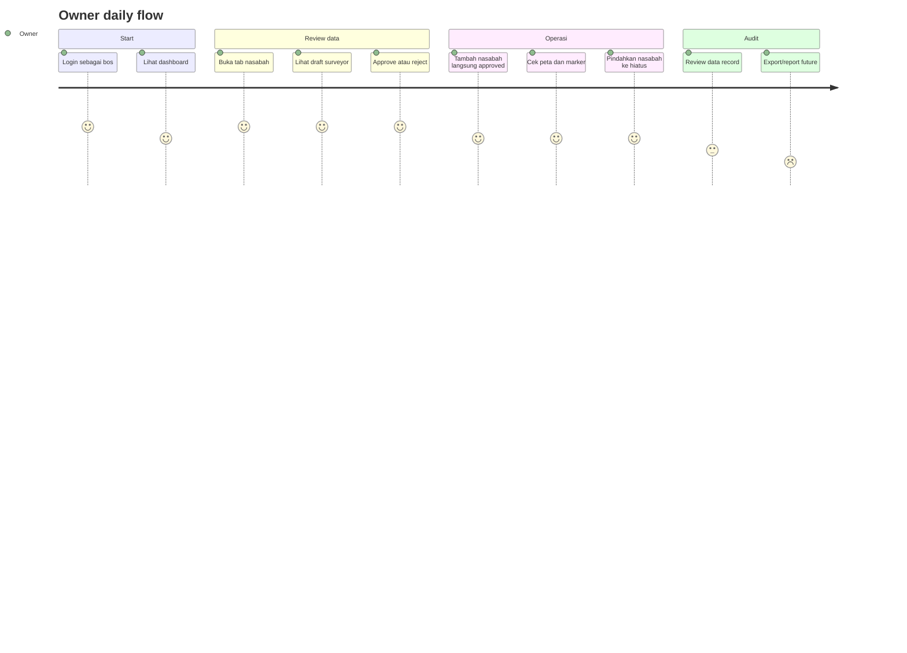
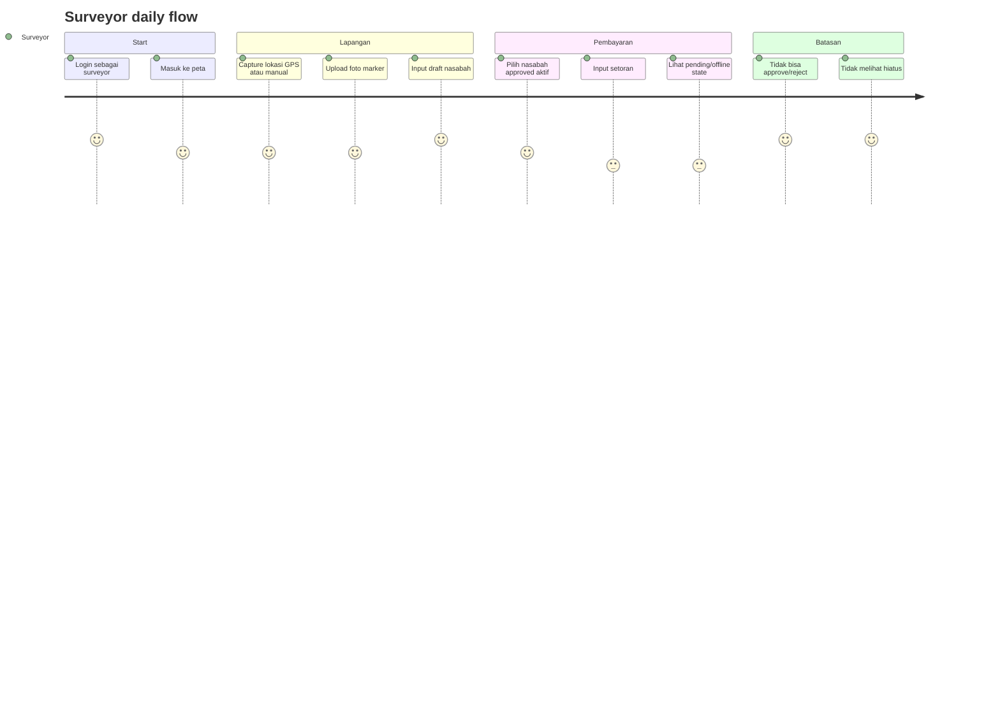

# LendMap Flow Audit

Tanggal audit: 2026-06-14  
Basis evaluasi: kode aplikasi, migrasi Supabase, dokumentasi formal, dan review paralel PM, Frontend, Backend, QA/DevOps.

## Ringkasan Eksekutif

Implementasi LendMap sudah lebih maju daripada dokumentasi formalnya. Flow inti untuk login, isolasi akun owner/surveyor, nasabah draft-review-hiatus, dan upload gambar marker sudah ada di aplikasi dan migrasi Supabase. Namun dokumentasi PRD, arsitektur, security, QA, dan runbook belum sepenuhnya mengejar perubahan UI/backend terbaru.

Status keseluruhan dokumentasi formal: **partial, perlu hardening sebelum produksi**.

Prioritas penutupan gap:

- Tambahkan acceptance criteria per flow bisnis.
- Formalisasi lifecycle nasabah: draft, approved, rejected, hiatus.
- Tambahkan RLS/storage matrix per tabel dan bucket.
- Tambahkan QA account matrix dan release smoke checklist.
- Tambahkan runbook Vercel, Supabase migration, backup, restore, dan rollback.

## Sistem dan Aktor

- **Owner/Bos**: akun prioritas. Masuk ke dashboard, peta, nasabah, dan audit. Bisa membuat nasabah langsung approved, approve/reject draft surveyor, dan memindahkan nasabah approved ke hiatus.
- **Surveyor**: masuk ke peta, nasabah, dan setoran. Bisa membuat marker dan draft nasabah. Tidak bisa approve nasabah dan tidak melihat data hiatus.
- **Supabase Auth**: sumber session.
- **Supabase Database**: profiles, nasabah, area_markers, area_status_history, setoran, surveyor_locations, audit_log, push_subscriptions.
- **Supabase Storage**: bucket marker-photos dan setoran-photos.
- **Vercel/Next.js**: deployment dan runtime aplikasi.

## Flow 1: Auth dan Role Routing

Status implementasi: **partial-complete**. Login, active profile gate, dan unauthorized route sudah ada. Dokumentasi belum cukup menjelaskan safe next path, inactive profile, dan first screen per role.

Catatan:

- Safe next path menerima path lokal yang diawali `/` dan menolak URL eksternal atau `//`.
- Inactive/missing profile diarahkan ke `/unauthorized`.
- Owner dan surveyor memakai shell yang sama, tetapi nav dan data difilter menurut role.

Acceptance criteria yang belum formal:

- Login sukses owner membuka dashboard.
- Login sukses surveyor membuka peta.
- Password salah menampilkan error tanpa redirect.
- User inactive tidak bisa masuk ke app.
- Logout menghapus session dan kembali ke login.

## Flow 2: Isolasi Tampilan Owner vs Surveyor

Status implementasi: **partial-complete**. Isolasi UI dan filter data ada di code. Dokumentasi belum memetakan hak akses per screen.

Rules utama:

- Owner melihat semua lifecycle nasabah.
- Surveyor melihat nasabah non-hiatus yang dibuat/ditugaskan kepadanya.
- Setoran hanya memakai nasabah approved + aktif.
- Draft surveyor tidak otomatis menjadi nasabah aktif.

Gap dokumen:

- Belum ada access matrix UI per role.
- Belum ada daftar negative cases, misalnya surveyor mencoba approve draft atau melihat hiatus.

## Flow 3: Lifecycle Nasabah

Status implementasi: **strong di aplikasi dan migrasi, lemah di dokumentasi formal**.

Data flow:

Business rules yang perlu dikunci:

- Owner input langsung `approved`.
- Surveyor input selalu `draft`.
- Hanya owner yang boleh approve/reject.
- Hanya owner yang boleh mengubah nasabah approved ke `hiatus`.
- `hiatus` tetap tersimpan untuk record owner, tidak muncul di flow karyawan/surveyor.
- Setoran tidak boleh dibuat untuk draft, rejected, hiatus, lunas, atau macet.

Gap dokumen:

- PRD belum punya lifecycle nasabah sebagai aturan produk.
- Acceptance criteria approve/reject/hiatus belum ada.
- Belum ada aturan revisi data setelah rejected.
- Belum ada aturan audit trail produk untuk review nasabah.

## Flow 4: Marker Area dan Upload Gambar

Status implementasi: **partial**. UI mendukung GPS/manual coordinate dan upload gambar marker ke Supabase Storage. Persistensi marker ke database masih perlu diverifikasi sebagai next integration karena flow saat ini masih local state di komponen.

Storage notes:

- Bucket marker: `marker-photos`.
- Path aktual: `{userId}/{timestamp}-{slug}.{ext}`.
- Helper upload belum enforce ukuran dan MIME type di client.
- Dokumentasi security lama perlu disesuaikan dengan path aktual dan policy bucket.

Gap dokumen:

- Belum ada matrix error state GPS/manual/upload.
- Belum ada ketentuan ukuran file, MIME type, dan kompresi gambar.
- Belum ada flow eksplisit dari marker local state ke `area_markers`.

## Flow 5: Setoran

Status implementasi: **partial/simulated**. UI setoran ada dan menggunakan nasabah approved+aktif, tetapi persistensi penuh dan upload bukti setoran belum selesai sebagai data flow produksi.

Business rules:

- Surveyor hanya boleh input setoran untuk nasabah yang approved dan aktif.
- Draft/rejected/hiatus tidak boleh muncul dalam opsi setoran.
- Bukti foto setoran sudah disiapkan bucket-nya, tetapi integrasi UI/storage masih future work.

Gap dokumen:

- Belum ada kontrak offline queue.
- Belum ada aturan partial payment.
- Belum ada upload bukti setoran end-to-end.
- Belum ada rekonsiliasi konflik saat sync gagal.

## Flow 6: Backend Supabase dan RLS

Status implementasi: **kuat di migrasi, dokumen arsitektur/security perlu update**.

Access matrix ringkas:

| Resource | Owner/Bos | Surveyor | Notes |
| --- | --- | --- | --- |
| profiles | read active users, owner-managed ops | read own/profile-limited | bootstrap dari auth trigger perlu dokumen jelas |
| nasabah | read all, create approved, review, hiatus | create own draft, read own non-hiatus | core lifecycle terbaru |
| area_markers | read/manage according policy | create/update assigned/own markers | UI marker DB persistence belum final |
| area_status_history | read/audit | read limited | trigger-owned, bukan client write |
| setoran | read/report | insert only approved aktif | current UI masih simulated/local |
| surveyor_locations | owner monitoring | surveyor upsert own location | realtime channel perlu UI owner |
| audit_log | owner/audit | restricted | perlu dashboard audit final |
| marker-photos | upload own path | upload own path | path aktual userId/timestamp-slug.ext |
| setoran-photos | future upload | future upload | integrasi belum selesai |

Backend documentation gaps:

- Arsitektur belum menjelaskan `surveyor_locations`, `push_subscriptions`, workflow nasabah review, dan `area_status_history` sebagai trigger-owned.
- Auth/profile bootstrap belum menjelaskan sumber role dari metadata, fallback full_name, default role, inactive profile, dan promosi owner.
- Security docs belum sinkron dengan storage path aktual.
- Test migrasi saat ini masih substring-level, belum integration-level RLS/trigger/storage tests.

## Flow 7: Deploy, Env, dan Release Gate

Status implementasi: **partial**. Env lokal dan Vercel sudah diarahkan oleh user, tetapi runbook formal masih kurang.

Required env matrix:

| Variable | Local | Vercel Preview | Vercel Production | Notes |
| --- | --- | --- | --- | --- |
| NEXT_PUBLIC_SUPABASE_URL | required | required | required | Project API URL |
| NEXT_PUBLIC_SUPABASE_ANON_KEY | required | required | required | Public anon key |
| SUPABASE_SERVICE_ROLE_KEY | local admin scripts only | avoid unless needed | avoid unless needed | Secret, never expose client |
| SUPABASE_ACCESS_TOKEN | CLI only | optional CI | optional CI | For scripted db operations |
| SUPABASE_PROJECT_REF | seelloevkfehricvxxmt | seelloevkfehricvxxmt | seelloevkfehricvxxmt | CLI/project targeting |

Release gate yang perlu jadi dokumen formal:

- `npm run lint`
- `npm run typecheck`
- `npm run test`
- `npm run build`
- Supabase migration status checked.
- Login owner and surveyor checked.
- RLS negative test checked.
- Marker photo upload checked.
- Nasabah draft/approve/reject/hiatus checked.
- Setoran approved+aktif gating checked.
- Backup/restore/rollback plan reviewed before production data.

## User Flow Owner

Owner acceptance criteria:

- Owner tidak bergantung pada verifikasi surveyor untuk input nasabah.
- Draft surveyor masuk ke daftar review owner.
- Owner bisa reject dengan catatan.
- Hiatus mengarsipkan nasabah tanpa menghapus record.
- Owner tetap bisa melihat record hiatus.

## User Flow Surveyor

Surveyor acceptance criteria:

- Surveyor tidak punya tab dashboard/audit.
- Surveyor create nasabah selalu draft.
- Surveyor tidak bisa membuat setoran untuk draft.
- Surveyor tidak melihat nasabah hiatus.
- Surveyor upload marker photo ke path milik user sendiri.

## Dokumentasi Formal: Completeness Audit

| Area | Status | Evidence | Gap utama |
| --- | --- | --- | --- |
| PRD | Partial | Problem, roles, feature inventory ada | Acceptance criteria dan user journey kurang |
| Sprint plan | Partial | Phase dan gates ada | Belum UAT detail dan release signoff |
| Roadmap | Partial | Prioritas dan risk ada | Belum menutup business rules terbaru |
| Architecture | Partial/Stale | Stack dan model awal ada | Belum sinkron dengan migrations terbaru |
| Security | Partial/Stale | RLS/storage/threat model ada | Storage path, bootstrap role, executable checks belum sinkron |
| Supabase foundation | Partial/Strong | Setup, migration, validation ada | Belum rollback/restore dan latest lifecycle lengkap |
| UI brief | Partial | Mobile shell dan screen brief ada | Error/empty state dan role flow belum detail |
| QA/DevOps | Missing/Partial | Script test ada | CI gate, smoke matrix, account matrix, rollback runbook belum ada |

## Recommended Documentation Backlog

Priority 0:

- Restore or recreate `.env.local.example` because README references it.
- Add production env runbook for Vercel preview and production.
- Add QA account matrix for `bos@kantor.com` and `surveyor1@kantor.com`.
- Add release smoke checklist.

Priority 1:

- Update PRD with acceptance criteria per flow.
- Update architecture with current Supabase table/trigger/RLS flow.
- Update security docs for actual storage path and validation responsibility.
- Add backend RLS matrix and storage policy matrix.

Priority 2:

- Add integration tests against disposable Supabase/Postgres.
- Add Playwright E2E for owner/surveyor isolation and nasabah lifecycle.
- Add backup/restore/rollback runbook.
- Add offline sync and conflict resolution spec.

## Kesimpulan

Flow bisnis terbaru sudah mulai terbentuk dengan benar di aplikasi: owner dan surveyor sudah dipisah, nasabah surveyor masuk draft, owner approve/reject, dan hiatus dipakai untuk arsip yang tidak muncul di flow karyawan. Bagian yang perlu dikejar sekarang adalah dokumentasi formal dan test/release gate supaya perubahan ini tidak cuma benar di UI saat ini, tetapi juga aman untuk dikembangkan agent lain dan siap diuji sebelum produksi.
